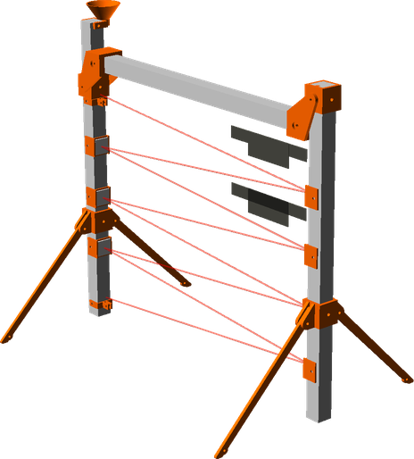
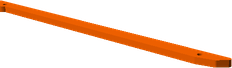
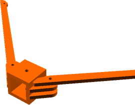

# Quadstacle Gate
# Assembly Guide

## Bill of Materials

Make sure you have all of the following parts before you begin.

### Printed Parts

Qty | Part Name | Image
--- | --- | ---
1 | [Hover Cone](../printedparts/stl/HoverCone.stl) |  | 
2 | [Leg Bracket 1](../printedparts/stl/LegBracket1.stl) |  | 
2 | [Leg Bracket 2](../printedparts/stl/LegBracket2.stl) |  | 
6 | [Mirror Holder](../printedparts/stl/MirrorHolder.stl) |  | 
2 | [Swivel Mount](../printedparts/stl/SwivelMount.stl) |  | 
2 | [Toe Bracket](../printedparts/stl/ToeBracket.stl) |  | 
4 | [Toe](../printedparts/stl/Toe.stl) |  | 

## Toe (x2)

### Printed Parts

Qty | Part Name | Image
--- | --- | ---
2 | [Toe Bracket](../printedparts/stl/ToeBracket.stl) |  | 
4 | [Toe](../printedparts/stl/Toe.stl) |  | 

### Assembly Steps

1. Do something

## Mirror Holder (x6)

### Printed Parts

Qty | Part Name | Image
--- | --- | ---
6 | [Mirror Holder](../printedparts/stl/MirrorHolder.stl) |  | 

### Assembly Steps

1. Hot glue the mirror tile onto the holder

## Leg (x2)

### Printed Parts

Qty | Part Name | Image
--- | --- | ---
1 | [Hover Cone](../printedparts/stl/HoverCone.stl) |  | 
2 | [Leg Bracket 1](../printedparts/stl/LegBracket1.stl) |  | 
2 | [Leg Bracket 2](../printedparts/stl/LegBracket2.stl) |  | 
2 | [Swivel Mount](../printedparts/stl/SwivelMount.stl) |  | 

### Sub-Assemblies

Qty | Name 
--- | --- 
2 | Toe
6 | Mirror Holder

## Final Assembly

### Sub-Assemblies

Qty | Name 
--- | --- 
2 | Leg

